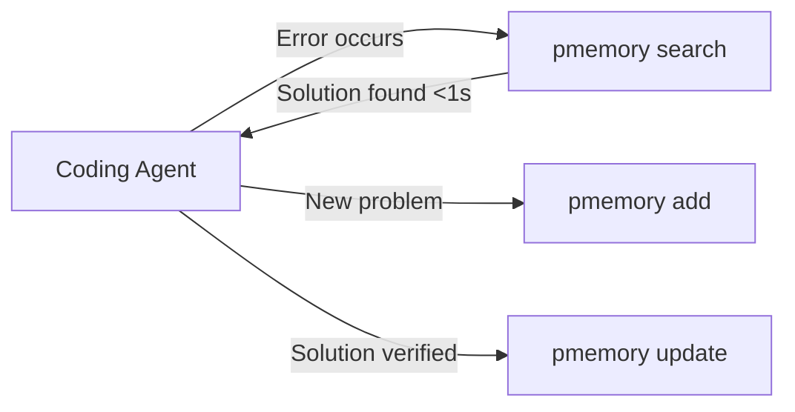

# project-memory

A high-performance knowledge management protocol and tool for software development. Accumulate and instantly retrieve solutions to problems you've solved before.

## Overview

project-memory (pmemory) is a **protocol specification** for knowledge management in software development. It's designed to work seamlessly with Coding Agents, enabling cumulative learning and rapid problem resolution.

### Key Features

- **Ultra-fast search**: <5ms response time for instant problem resolution
- **Cumulative learning**: Every solved problem becomes a reusable asset
- **Agent-ready**: Designed for seamless integration with AI coding assistants
- **Protocol-based**: Standardized format enables tool interoperability
- **Time-saving metrics**: Track how much time your team saves

## Why project-memory?

### The Problem

1. **Repetitive problem-solving**: Teams solve the same problems repeatedly
2. **Knowledge silos**: Solutions aren't shared across team members
3. **Agent limitations**: AI assistants reset their learning each session
4. **No standard**: Each project has its own ad-hoc solution storage

### The Solution

project-memory provides a standardized, high-performance protocol for storing and retrieving problem-solution pairs, enabling:

```
Traditional: Error → Search → Trial & Error → Solution (minutes to hours)
With pmemory: Error → pmemory → Solution applied (< 1 second)
```

## Quick Start

```bash
# Add a solution
pmemory add "TypeError: Cannot read property 'user' of undefined" \
  --solution "Initialize req.context before middleware"

# Search for solutions (< 5ms)
pmemory search "TypeError Cannot read property"

# View statistics
pmemory stats
> Total memories: 1,247
> Average query time: 3.2ms
> Time saved this month: 147 hours
```

## Protocol Specification

project-memory is designed as a protocol, similar to HTTP or Git:

```yaml
# Memory Entry Structure
memory_entry:
  id: UUID
  problem: string
  solution: string
  metadata:
    created: ISO8601
    author: identifier
    verification_count: integer
  indexes:
    error_hash: sha256
    context_hash: sha256
  agent_data:
    success_rate: float
    average_resolution_time: duration
```

## Integration with Coding Agents

project-memory works seamlessly with AI coding assistants:



## Performance Requirements

- **Tool execution**: < 5ms
- **Large codebases**: < 50ms max
- **User experience**: Complete solution in < 1 second

## Installation

```bash
# Coming soon
cargo install project-memory
# or
npm install -g project-memory
```

## Contributing

We welcome contributions! Please see our [Contributing Guidelines](CONTRIBUTING.md) for details.

## Roadmap

- [ ] Phase 1: High-performance prototype (Rust implementation)
- [ ] Phase 2: Protocol standardization and RFC
- [ ] Phase 3: SDK development for major languages
- [ ] Phase 4: IDE and editor integrations

## Difference from project-checklist

- **project-checklist (pcheck)**: Future-oriented task management (TODOs)
- **project-memory (pmemory)**: Past-oriented knowledge capture (solutions)

They work together:
```
pcheck → Get task → Execute → Hit error → pmemory → Apply solution → Update pcheck
```

## License

This project is licensed under the MIT License - see the [LICENSE](LICENSE) file for details.

## Contact

- GitHub Issues: [Report bugs or request features](https://github.com/ryo-morimoto/project-memory/issues)
- Discussions: [Join the conversation](https://github.com/ryo-morimoto/project-memory/discussions)

---

*project-memory: Turn every solved problem into a permanent asset.*