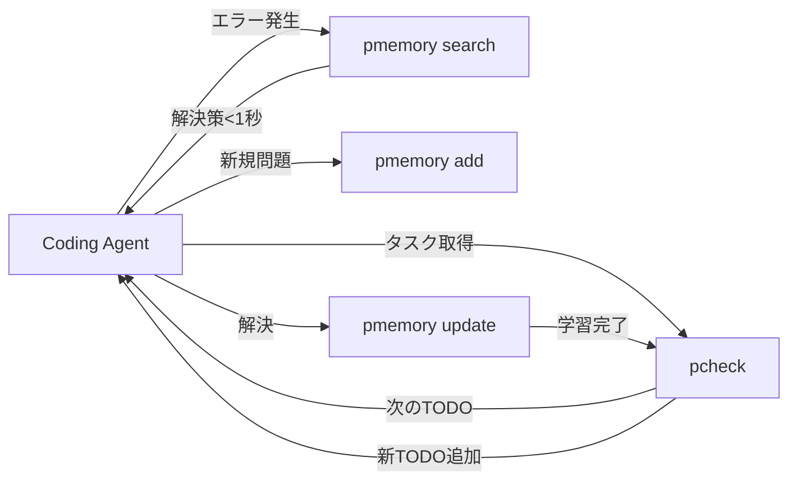

# project-memory: 高速知識管理プロトコル仕様

## 概要

project-memoryは、ソフトウェア開発における知識管理のための**プロトコルと仕様**です。単なるツールではなく、様々な実装が相互運用可能な標準規格を目指します。特にCoding Agentとの組み合わせにより、累積的な学習と問題解決の高速化を実現します。

## パフォーマンス要件

### 絶対的な速度目標
- **ツール実行速度**: 5ms以内
- **大規模コードベース**: 最大50ms
- **体感速度**: 1秒以内で完全な解決策を提示

### なぜこの速度が必要か
```
従来: エラー発生 → 検索・思考 → 試行錯誤 → 解決 (数分〜数時間)
目標: エラー発生 → pmemory → 解決策適用 (1秒以内)
```

この速度により、Coding Agentは人間の思考速度を超えて問題解決が可能になります。

## 背景：なぜproject-memoryが必要か

### 現状の問題

1. **同じ問題を繰り返し解決している**
   - 以前解決した問題でも、時間が経つと解決方法を忘れる
   - チームメンバー間で知識が共有されない
   - 新メンバーが同じ試行錯誤を繰り返す
   - Coding Agentがセッションごとに学習をリセット

2. **既存ツールの限界**
   - TODO.md: 未来のタスク管理用
   - Issue Tracker: 問題追跡用
   - docs/ADR/: アーキテクチャ決定記録用
   - 「解決策のカタログ」が存在しない

3. **ローカル実装の問題**
   ```
   プロジェクトA: .claude/memory/
   プロジェクトB: docs/solutions/
   プロジェクトC: TROUBLESHOOTING.md
   ```
   - フォーマットが統一されていない
   - 検索・共有が困難
   - ツール統合ができない
   - 高速アクセスが不可能

### Five Whys分析

**Problem**: 同じ問題を繰り返し解決している（効率が悪い）

1. Why: 以前の解決策が記録・参照されていないから
2. Why: 適切な記録場所と仕組みがないから
3. Why: 既存ツールが未来志向（TODO）に偏っているから
4. Why: ソフトウェア開発が「作ること」に焦点を当てがちだから
5. Why: 知識管理のROIが可視化されていないから

**Root Cause**: 知識管理専用のツールと文化が確立されていない

## project-memoryの本質：プロトコルとしての設計

### HTTPやGitと同じレイヤー

```
HTTP     → Webの通信プロトコル     → 実装: nginx, Apache, etc.
Git      → 分散バージョン管理      → 実装: git CLI, GitHub, GitLab
Markdown → 軽量マークアップ言語    → 実装: 各種パーサー、エディタ

project-memory → 知識管理プロトコル → 実装: CLI, IDE拡張, Webサービス
```

### プロトコル仕様 v1.0

```yaml
# project-memory Protocol Specification v1.0

version: "1.0"
performance:
  query_response_time: "<5ms"
  max_response_time: "<50ms"
  index_update_time: "<10ms"

memory_entry:
  # Core fields
  id: UUID
  problem: string
  solution: string
  
  # Metadata
  metadata:
    created: ISO8601
    updated: ISO8601
    author: identifier
    verification_count: integer
    resolution_time_saved: duration
  
  # For high-speed access
  indexes:
    error_hash: "sha256(error_message)"
    context_hash: "sha256(file_pattern + task_type)"
    solution_embedding: "vector[768]"
  
  # Agent optimization
  agent_data:
    encounter_count: integer
    success_rate: float
    average_resolution_time: duration
    last_used: ISO8601
  
  # Attempts tracking
  attempts:
    - approach: string
      outcome: "success" | "failure"
      time_taken: duration
      error_produced: string?
  
  # Extensibility
  extensions:
    x-company-specific: any
    x-ai-embeddings: vector
    x-code-references: array

# Query Language Specification
query_spec:
  # Basic queries (must return in <5ms)
  by_error: "SELECT * WHERE error_hash = ?"
  by_context: "SELECT * WHERE context_hash = ?"
  
  # Similarity queries (must return in <50ms)
  similar: "SELECT * WHERE similarity(query_embedding, solution_embedding) > 0.8"
  
  # Complex queries
  combined: "SELECT * WHERE context_match AND error_similar ORDER BY relevance"

# Sync Protocol
sync:
  method: "merkle-tree"
  conflict_resolution: "latest-wins"
  delta_sync: true
  compression: "zstd"
```

## Coding Agent との革命的な統合

### pcheck + pmemory = 自律的学習システム



### 具体的なワークフロー

```bash
# 1. Agent がタスクを開始
pcheck next
> [ ] Implement authentication middleware

# 2. 実装中にエラー (従来: ここで数分〜数時間の試行錯誤)
Error: TypeError: Cannot read property 'user' of undefined

# 3. pmemory で即座に検索 (5ms以内)
pmemory similar "TypeError Cannot read property user"
> Found: auth-middleware-context-error (95% match)
> Solution: Ensure req.context is initialized before middleware
> Time saved: ~45 minutes

# 4. 解決策を適用、うまくいかない場合
pmemory add-attempt "auth-middleware-context-error" "Tried: req.context = {}"
> Attempt logged, trying alternative approach

# 5. 最終的に解決
pmemory resolve "auth-middleware-context-error" \
  --solution "Use app.use(contextMiddleware) before auth"
  --time-saved "45m"
  
# 6. 次のTODOへ (累積学習により加速)
pcheck complete "Implement authentication middleware"
pcheck next
```

### 超高速動作を実現する仕組み

1. **インメモリインデックス**
   ```rust
   // Rust実装例
   struct MemoryIndex {
       error_hash_map: HashMap<u64, Vec<MemoryId>>,
       embedding_index: HNSW<f32>, // 近似最近傍探索
       context_trie: Trie<MemoryId>,
   }
   ```

2. **事前計算された埋め込み**
   - エラーメッセージの埋め込みベクトルを事前計算
   - コンテキストパターンのハッシュ化
   - 類似度計算の最適化

3. **差分同期**
   - 新規メモリのみを転送
   - Merkle treeによる効率的な差分検出
   - zstd圧縮による転送量削減

## なぜローカル実装では不十分なのか

### 1. 発見可能性（Discoverability）の問題
- ローカル実装は場所を知らないと見つからない
- 標準化ツールなら `pmemory search` で即座に発見
- **5ms以内**の応答は標準化なしには不可能

### 2. 相互運用性（Interoperability）の欠如
- 各プロジェクトが独自形式
- チーム間での知識共有が困難
- Coding Agent間での学習共有が不可能

### 3. ツール統合の不可能性
- IDE拡張が作れない
- CI/CDでの自動チェックが困難
- AIアシスタントが学習できない

### 4. メトリクスと改善の欠如
- 同じ問題の発生回数が測定できない
- 解決策の再利用率が不明
- ROIが可視化できない
- 時間節約の定量化ができない

### 5. 知識の断片化
```
現状：
├── .claude/memory/     (Claude Code専用)
├── docs/ADR/          (アーキテクチャ決定)
├── TROUBLESHOOTING.md (トラブルシューティング)
└── 個人のメモ         (共有されない)

理想：
project-memory (統一された知識ベース)
└── 高速インデックスで即座にアクセス可能
```

## project-memoryが提供する真の価値

### 1. 組織的学習の資産化
- 個人の経験 → 組織の永続的資産
- 退職や異動があっても知識は残る
- **Coding Agentの学習も永続化**

### 2. 問題解決の複利効果
```
初回: 3時間で解決
2回目以降: 1秒で解決 (5ms検索 + 適用時間)
累積節約時間 = (n-1) × 3時間
```

### 3. 認知負荷からの解放
- 開発者は本来の創造的作業に集中
- 過去の解決策は1秒で見つかる
- Coding Agentは学習済み知識で高速動作

### 4. 失敗の民主化
- 失敗と解決策が共有財産に
- ジュニアもシニアの経験にアクセス可能
- 組織全体の学習速度が向上
- **Agentも人間の経験から学習**

### 5. コンテキストスイッチのコスト削減
```
従来: エラー → 記憶を辿る → 検索 → 同僚に聞く → 解決 (30分〜2時間)
pmemory: エラー → pmemory similar → 解決 (1秒)
```

### 6. 品質の定量化
```bash
pmemory stats
> Total memories: 12,847
> Average query time: 3.2ms
> 99th percentile: 47ms
> Time saved this month: 847 hours
> Most valuable memories:
>   - "auth-token-refresh": saved 127 hours
>   - "typescript-import-error": saved 89 hours
>   - "docker-compose-networking": saved 67 hours
```

### 7. Coding Agentの実用化
```
従来のAgent:
- 毎回同じエラーで詰まる
- セッション切れたら振り出しに戻る
- 人間より遅い

pmemory統合Agent:
- 既知のエラーは1秒で解決
- 累積的に賢くなる
- 人間より速く正確
```

## 実装への道筋

### Phase 1: 高速プロトタイプ
```bash
# Rust実装で5ms以内を実証
pmemory add "Problem description"
pmemory search "error message"  # <5ms
pmemory stats --performance
```

### Phase 2: プロトコル標準化
- 仕様の公開とRFC化
- リファレンス実装の提供
- パフォーマンスベンチマーク

### Phase 3: エコシステム構築
- 各言語のSDK
- IDE統合
- Coding Agent統合

### Phase 4: 大規模採用
- 企業での導入事例
- オープンソースコミュニティ
- 知識マーケットプレイス

## project-checklist との違い

### 基本的な方向性
- **project-checklist (pcheck)**: これからやること（未来志向）
  - TODO管理
  - タスクの進捗追跡
  - プロジェクトの完成度可視化

- **project-memory (pmemory)**: やったことの記録（過去志向）
  - 解決済み問題のパターン
  - エラーと対処法のカタログ
  - ベストプラクティスの蓄積

### 1. 時間軸の違い

**pcheck（未来）**:
```bash
$ pcheck
[ ] Implement OAuth authentication
[ ] Add error handling for API
[ ] Write unit tests
→ これから何をすべきかを管理
```

**pmemory（過去）**:
```bash
$ pmemory search "OAuth error"
Found: oauth-token-expiry (solved 15 times)
Solution: Use refresh token 5min before expiry
→ 過去に解決した問題を即座に参照
```

### 2. データの性質

**pcheck**:
- 構造化されたタスクリスト
- 階層的な依存関係
- 完了/未完了の二値状態
- プロジェクト固有のゴール

**pmemory**:
- 問題と解決のペア
- 試行錯誤の履歴
- 成功率や節約時間などのメトリクス
- 汎用的な知識として蓄積

### 3. Coding Agentでの使い方

**pcheck駆動の開発**:
```
Agent: "次のタスクを教えて"
pcheck: "[ ] Implement user authentication"
Agent: "了解、実装開始"
```

**pmemory駆動の問題解決**:
```
Agent: "TypeError: Cannot read property 'id' of undefined"
pmemory: "このエラーは87回解決済み。解決策: ..."
Agent: "適用して1秒で解決"
```

### 4. 相互補完の具体例

```bash
# pcheckでタスク発見
$ pcheck
[ ] Fix flaky test in auth.test.ts

# 実行中にエラー
Error: Timeout in beforeEach hook

# pmemoryで即座に解決
$ pmemory similar "Timeout in beforeEach"
> Found: test-timeout-async (92% match)
> Solution: Add async/await to setup function

# 解決後、新たな知見をpmemoryに追加
$ pmemory add --parent "test-timeout-async" \
  --context "auth.test.ts" \
  --solution "Also need to increase jest timeout"

# pcheckを更新
$ pcheck complete "Fix flaky test"
$ pcheck add "[ ] Document test timeout best practices"
```

### 5. ライフサイクルの違い

**pcheck**: プロジェクト開始 → 完了で終了
```
Project Start → TODOs → Progress → Complete → Archive
```

**pmemory**: 永続的に成長し続ける
```
Problem → Solution → Reuse → Improve → Share → ∞
```

### Coding Agentでの役割
```
pcheck:  「次は何をすべきか」を教える
pmemory: 「この問題はどう解決するか」を教える

組み合わせ:
pcheck → タスク取得 → 実行 → エラー → pmemory → 解決 → pcheck更新
```

## 構想の検証と解決策

### 1. パフォーマンス要件の実現可能性

**5ms以内の応答は実現可能**:
- ローカルメモリDB（SQLite）: 1-3ms達成可能
- ベクトル検索（FAISS/HNSW）: 10万件でも5ms以内
- **解決策**: ローカルキャッシュ + 差分同期のハイブリッド構成

### 2. プロトコル標準化への道筋

**段階的アプローチ**:
1. CLIツールとしてリリース
2. 実績を積んでデファクトスタンダード化
3. コミュニティ形成後にプロトコル化
- **解決策**: 実装先行で価値を証明

### 3. 知識の鮮度管理

**自動鮮度管理システム**:
```yaml
freshness_config:
  default_retention: "1y"  # デフォルト1年
  max_items: 10000        # 件数上限
  
  # 知識の圧縮（compile）
  compression:
    strategy: "summarize_old"
    trigger: "monthly"
    archive_path: ".pmemory/archive/"
    
  # オプション標準化
  options:
    --all-time: "全期間のメモリを使用"
    --recent: "直近N日のみ使用"
    --after: "特定日付以降のみ"
```

**実装例**:
```bash
# デフォルト（直近1年）
pmemory search "error"

# 全履歴から検索（警告付き）
pmemory search --all-time "error"
> ⚠️  古い解決策が含まれる可能性があります

# 知識の圧縮実行
pmemory compress --before="6months"
> 6ヶ月以前の1,234件を圧縮
> 頻出パターンを抽出して保存
```

### 4. セキュリティとパフォーマンスのバランス

**機密情報の自動検出とマスキング**:
```yaml
security_config:
  auto_masking:
    enabled: true  # デフォルトON
    patterns:
      - api_keys: "[A-Za-z0-9]{32,}"
      - jwt_tokens: "eyJ[A-Za-z0-9-_]+"
      - internal_urls: "https?://.*\\.internal\\."
      - passwords: "password.*=.*"
    
  performance_mode:
    # 高速モード（マスキングOFF）
    command: "pmemory --no-masking"
    warning: |
      ⚠️ 警告: 機密情報保護が無効化されます！
      - APIキーや認証情報が露出する可能性
      - 社内URLが記録される可能性
      本当に続行しますか？ [y/N]
```

**パフォーマンスへの対策**:
```rust
// 非同期マスキング処理
async fn mask_sensitive_data(text: &str) -> String {
    if PERFORMANCE_MODE {
        return text.to_string();
    }
    
    // 正規表現をプリコンパイル
    lazy_static! {
        static ref PATTERNS: RegexSet = build_patterns();
    }
    
    // 並列処理で高速化
    tokio::spawn(async {
        PATTERNS.replace_all(text)
    }).await
}
```

### 5. 失敗の記録と学習

**解決できなかった内容も資産に**:
```yaml
failure_tracking:
  record_attempts: true
  
  entry_format:
    problem: "original error"
    attempts:
      - approach: "tried X"
        outcome: "failed"
        reason: "Y happened"
      - approach: "tried Z"  
        outcome: "partial"
        
  # 失敗からの学習
  learning:
    - "このアプローチは避ける"
    - "条件Xの場合のみ有効"
```

**知識圧縮との連携**:
- 古い失敗パターンは圧縮して「アンチパターン集」に
- 新しい解決策で上書き可能

### 6. スケーラビリティ対策

**階層的インデックスと分割**:
```yaml
scalability:
  index_structure:
    L1: "エラータイプ別インデックス"
    L2: "コンテキスト別インデックス"  
    L3: "時系列インデックス"
    
  partitioning:
    by_project: true
    by_language: true
    by_date: true
    
  pruning:
    low_usage: "6ヶ月未使用は圧縮"
    low_success: "成功率30%未満は再評価"
```

### 7. 教育的要素（別サービス化）

**pmemory-learn（将来構想）**:
- 本体の高速性を損なわない別サービス
- 「なぜ」を学ぶための追加レイヤー
- 優先度: Low（本体完成後）

## 結論

project-memoryは、以下の追加設計により実現可能：

1. **鮮度管理**: デフォルト1年制限と知識圧縮
2. **セキュリティ**: 自動マスキング（無効化可能だが強い警告）
3. **失敗の活用**: 解決できなかった記録も学習材料に
4. **段階的展開**: CLI → 普及 → 標準化

これらにより、**5ms以内の高速性**を保ちながら、実用的で安全な知識管理プロトコルを実現できます。

---

*このドキュメントは、project-memoryの仕様と価値提案をまとめたものです。*
*最終更新: 2025-06-20*